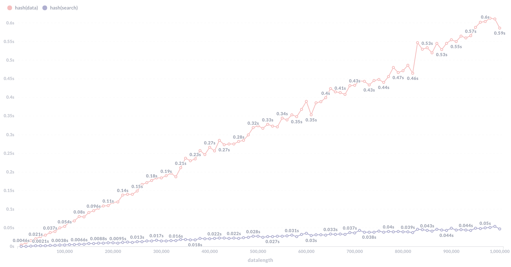

## Data-Structure-Comparison

#### 測試環境：

* 電腦：Digital Ocean Basic Droplet(Premium AMD with NVMe SSD)
* 作業系統：debain 10
* CPU: 1 AMD vCPU
* RAM: 1GB

#### 資料集生成方法

* string(不唯一)

  1. 使用一個陣列儲存英文字母小寫"a" 到大寫"Z"

  2. 生成一個從0到51隨機數字，每次生成一個數字都代表一個英文字母

  3. 根據指定數字，生成一個陣列再將英文字母分別放到陣列中

     ```pseudocode
     function GenRandStr(length){
     	charset="abcde....";
       for (i=0;i<length;i++){
       	index = rand()%52;
         randstring[i] = charset[index];
       }
         return randstring;
     }
     ```

     

* string(唯一)

  1. 使用hashtable確認之前的string是否出現過

     ```pseudocode
     string = GenRandStr(length);
     if (checkHashTable(string)){ //檢查是否出現過
     	print(string);
     }
     ```

#### 資料結構演算法

1. Linked List

   * 建立

     1. 定義一個Node struct內含Data以及一個pointer to Node

     2. 每次新增一筆資料就新增一個Node以及將上一個Node的pointer指向目前的Node

        ```pseudocode
        struct Node {
        	var Data;
        	Node* ptr;
        };
        function insertLinkedList(node,data){
        	newNode = new Node();
        	newNode.Data = data;
        	if(node == NULL) return newNode;
        	node.ptr = newNode;
        	return node;
        }
        ```

   * 查詢

     1. 檢查當前Node的Data資料，若不是要找的資料則移到下一個，指到下一個是NULL

        ```pseudocode
        function findNode(node,value){
        	while(node!=NULL){
        		if (node.Data == value) return node;
        		else node = node.ptr;
        	}
        	return NULL;
        }
        ```

2. Array

   * 建立

     1. 建立一個array

     2. 將資料依序從0開始插入

        ```pseudocode
        var arr[];
        function insert(arr,idx,value){
        	arr[idx] = value;
        }
        for (i=0;i<length;i++){
        	insert(arr,i,value);
        }
        ```

   * 查詢

     1. 從第0 個位址開始一個一個檢查，若找不到則回傳-1

        ```pseudocode
        function searchArray(arr,value,length){
        	for(i=0;i<length;i++){
        		if(arr[i] == value) return i;
        	}
        	return -1;
        }
        ```

3. Array With Binary Search

   * 建立

     1. 同Array，但最後將其資料排序

        ```pseudocode
        /* ... */ //同Array
        sort(arr);
        ```

   * 查詢

     1. 將Array中最靠近中間的元素拿出來與被查詢值比較，並將Array以此分為左Array、中間、右Array

     2. 若值一樣則為找到元素，若較大則對左Array執行步驟1與2，若較小則對右Array執行步驟1與2，直到找到元素或無法拿出中間的元素。

        ```pseudocode
        function binarySearch(arr,value,start,end){
        	if(start > end) return -1;
        	mid = (start + end) /2;
        	if(arr[mid] == value){
        		return mid;
        	}
        	if (arr[mid] > value) return binarySearch(arr,value,start,mid-1);
        	else return binarySearch(arr,value,mid+1,end);
        }
        ```

4. Binary Search Tree

   * 建立

     1. 定義一個Node struct內含Data以及兩個pointer to Node名稱為left與right

     2. 插入資料時，若原本沒有node則新增個node

     3. 若已存在node則從root node開始比較，若node的值比查詢值大則往left node 走，若較小則往right node 走

     4. 重複步驟3直到right node 或 left node 為NULL

     5. 在當前位址新增一個node

        ```pseudocode
        struct Node {
        	var Data;
        	Node* left;
        	Node* right;
        };
        function insertBinarySearchTree(node,value){
        	if(node == NULL){
        		newNode = new Node();
        		newNode.Data = value;
        		return newNode;
        	}
        	Node * last;
        	while(node){
        		last = node;
        		if(node.Data > value) node = node.left;
        		else node = node.right;
        	}
        	node = new Node());
        	node.Data = value;
        	if(last.Data > value) last.left = node;
        	else last.right = node;
        }
        ```

   * 查詢

     1. 從root  node開始，若node的值比查詢值大則往left node 走，若較小則往right node 走

     2. 重複步驟一直到找到或node為NULL

        ```pseudocode
        function find(node,value){
        	while(node){
        		if (node.Data == value) return node;
        		else if (node.Data > value) node = node.left;
        		else node = node.right;
        	}
        	return NULL;
        }
        ```

5. AVL

   * 建立

     1. 定義一個Node struct內含Data、Height以及兩個pointer to Node名稱為left與right

     2. 插入資料時，若原本node為NULL則新增個node，並將其Height設為1

     3. 若已存在node則從root node開始比較，若node的值比查詢值大則呼叫自己並將node.right傳入，若較小則往呼叫自己並將node.left傳入

     4. 步驟3會回傳node，計算此node的Height並將得到的hieght傳入node.Height

     5. 計算node的balancefactor並對其進行平衡

        ```pseudocode
        function insert(node,value){
        	if (node == NULL){
        		newNode = new Node();
        		newNode.Data = value;
        		newNode.Height = 1;
        		return newNode;
        	}
        	if (node.Data > value) node.right = insert(node.right,value);
        	else node.left = insert(node.left,value);
        	node.Height = getNodeHeight(node); //計算node高度
        	if (balanceFactor(node) == 2 && balanceFactor(node->left) == 1) return LL(node); //LL,LR,RR,RL 會對node進行平衡
          else if (balanceFactor(node) == 2 && balanceFactor(p->left) == -1) return LR(p);
          else if (balanceFactor(p) == -2 && balanceFactor(p->right) == -1) return RR(p);
        	else if (balanceFactor(p) == -2 && balanceFactor(p->right) == 1) return RL(p);
        	return node
        }
        ```

   * 查詢

     1. 與Binary Search Tree一樣

6. Hash

   * 建立

     1.  建立一個大小為n的array其元素為指向linked list的pointer

     2. 使用hash function對要插入的資料產生一個大小小於n的值idx

     3. 檢查array[a]是否已有linked list 存在，若沒有則建立一個並將值插入，若有找linked list的最尾端並將值插入

        ```pseudocode
        function insert(array,value,index){
        	var idx = hashFunction(value);
        	if(array[idx]==NULL) {
        		array[idx] = new LinkedList();
        		array[idx].Data = value;
        		return;
        	}
        	insertLinkedList(array[idx],value); //前述已有解釋
        }
        ```

   * 查詢

     1. 使用hash function對要插入的資料產生一個值idx
     2. 若array[idx]無值表示找不到
     3. 若array[idx]有值則對其linked list 執行查詢（如同第一點）

#### 測試與收集方法

1. 使用shell script 傳入使用者指定的資料區間給資料集生成程式（此次測試資料區間從10000到1000000）

2. 使用shell script 傳入不同的argument 給以上不同的排序程式

5. 程式輸出格式

| type | datalength | searchlength | datatime | searchtime |
| ---- | ---------- | ------------ | -------- | ---------- |

5. 使用python蒐集程式輸出資料並將資料傳入DataBase

6. 使用sql查詢資料並用[MetaBase](https://www.metabase.com/)圖像化，例如以下

   ```sql
   SELECT datalength,searchlength, 
   AVG(CASE WHEN type='string' THEN datatime END) AS "avl(data)"
   #使用AVG()取平均值，並用 GROUP BY datalength 可以處理傳入多次測試結果時，相同datalength會有重複資料的問題，並藉由取平均值使結果更準確
   FROM "Result" GROUP BY datalength,searchlength ORDER BY datalength;
   ```


#### 紀錄

1. Linked List

   

   時間複雜度

   * 建立：Big-O(1)
   * 查詢：Big-O(n)

   空間複雜度： big-O(n)

2. Array

   

   時間複雜度

   * 建立：Big-O(1)
   * 查詢：Big-O(n)
   
   空間複雜度： big-O(n)

3. Array With Binary Search

   
   
   時間複雜度

   * 建立：Big-O(nlogn)
   * 查詢：Big-O(logn)
   
   空間複雜度： big-O(n)

4. Binary Search Tree

   
   
   時間複雜度

   * 建立：Big-O(logn)
   * 查詢：Big-O(logn)
   
   空間複雜度： big-O(n)

5. AVL

   
   
   時間複雜度

   * 建立：Big-O(logn)
   * 查詢：Big-O(logn)
   
   空間複雜度： big-O(n)

6. Hash

   
   
   時間複雜度

   * 建立：Big-O(1)
   * 查詢：Big-O(1)
   
   空間複雜度： big-O(n)

7. 比較

   * 建立

     

   * 查詢

     
   
     無array linkedlist
     
     .png)


#### 總結

從以上的折線圖中可知在建立資料時速度最快的是array和linkedlist估計是因為資料在插入時不需要做什麽處理，再來才是Hash因為Hash Function需要計算所以比較耗時間，接著是array with binary search因為資料要做排序所以耗時比 array多，最後才是BST因為每次插入都可能要比較多次，所以速度第二慢，最後是AVL因為除了要做跟BST一樣的事情還要平衡，所以速度最慢。而在查詢這方面可以明顯看出linkedlist、array最慢，但很奇特的是array在資料數量比較少的時候有時快有時慢，估計是因為測試次數不夠多或者測試資料有問題。撇除array和linked list不看後，可以由圖中得知Hash一直保持最快，而在資料量較少的時候，bst最快其次是avl再來是array with binary search，但在資料量增加後，這三個的排序剛好反過來。


#### 連結

* 程式碼：https://github.com/yungen-lu/Data-Structure-Comparison
* 資料視覺化：https://metabase.do.yungen.studio/public/dashboard/23a263fd-c6a9-4795-a4b2-2d2e4febd0e2


#### 參考連結

* https://cooervo.github.io/Algorithms-DataStructures-BigONotation/
* https://www.bigocheatsheet.com/
